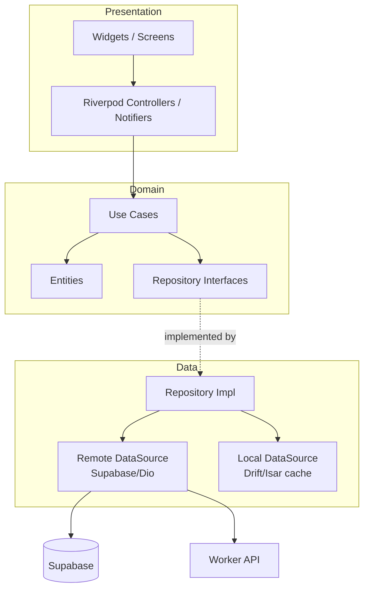
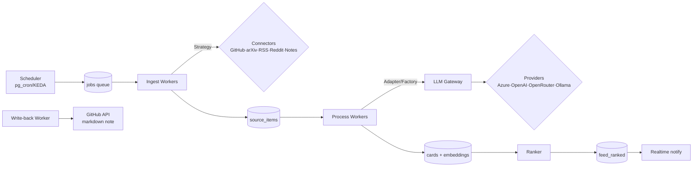
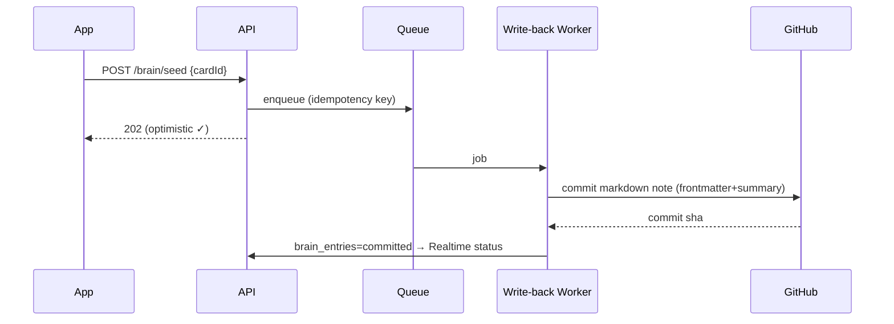

# Low-Level Design (LLD) — Pier 36

> Companion to the HLD (`design-doc.md`). This doc fixes the **internal architecture, design patterns,
> low-latency strategy, and the Stories-inspired design system** (with a concrete, fresh gradient palette),
> plus the **testing suite** and **GitHub CI/CD** workflow.

**Status:** Draft v0.1 · **Owner:** @naveenneog · **Last updated:** 2026-06-23
**Related:** `design-doc.md` (HLD) · `CHANGELOG.md` (decision & change log)

---

## 1. Design Principles (the "best approach" rules)

1. **Keep the LLM out of the request path.** Summaries/embeddings are computed **offline** in the pipeline;
   the client only ever reads pre-baked cards. → predictable low latency.
2. **CQRS-lite:** rank at **write time** into a materialized `feed_ranked` read model; reads are a single
   indexed, keyset-paginated query.
3. **Offline-first & optimistic UI:** local cache is the source of truth for the UI; actions apply instantly
   and reconcile in the background.
4. **Stateless, queue-driven workers:** every external/heavy task is a retryable job → horizontal scale.
5. **Everything pluggable behind an interface:** connectors and LLM providers are Strategies chosen by config.
6. **Idempotent by design:** content hashes + idempotency keys make retries safe (no dupes, no double-writes).
7. **Fail soft:** circuit breakers + cached fallbacks; the feed always renders something.

---

## 2. Latency Budget (targets, p95)

| Interaction                         | Target                          | How we hit it                                            |
|-------------------------------------|---------------------------------|----------------------------------------------------------|
| App cold start                      | < 2.0 s                         | deferred init, cached feed, skeletons                    |
| Feed first card paint (warm)        | < 800 ms                        | local cache render + background refresh                  |
| Feed first card paint (cold)        | < 1.5 s                         | keyset query on `feed_ranked` + blurhash placeholders    |
| Card → card swipe                    | 60 fps (≤16 ms/frame); 120 fps capable | const widgets, image precache, no jank on scroll |
| Feed read API                       | < 150 ms                        | materialized read model + indexes + Supavisor pooling    |
| Like / Save / Dismiss (perceived)   | **0 ms** (optimistic)           | local apply; async commit < 200 ms                       |
| Media thumbnail                     | instant (blurhash) → < 300 ms   | CDN + responsive sizes + `flutter_cache_manager`         |
| New content → on screen (realtime)  | < 2 s from ingest               | Supabase Realtime push to `feed:{userId}`                |
| Seed-to-Brain write-back            | < 1.5 s (async, non-blocking)   | queued job; UI confirms optimistically                   |

---

## 3. Component Architecture

### 3.1 Flutter app — Clean Architecture (feature-first)



- **State/DI:** **Riverpod 2.x** (code-gen) — reactive, testable, no `BuildContext` coupling.
- **Navigation:** **go_router** (declarative, deep-linkable: `app://feed`, `app://seed`, `app://card/{id}`).
- **Networking:** Supabase Dart client for data/auth/realtime; **Dio** (interceptors: auth, retry, logging) for
  the Worker API.
- **Local cache / offline:** **Drift** (typed SQLite) for cards/feed; `flutter_cache_manager` for media;
  `flutter_secure_storage` for tokens.
- **Error model:** `Result<T, AppError>` (sealed) — no thrown exceptions across layers.

### 3.2 Backend Worker (Python / FastAPI on Azure Container Apps)



### 3.3 Monorepo layout

```
pier-36/
├─ app/                      # Flutter
│  ├─ lib/
│  │  ├─ core/              # theme, router, di, network, errors, env
│  │  ├─ design_system/     # tokens, gradients, components (the "fresh" UI kit)
│  │  ├─ features/
│  │  │  ├─ feed/  sources/  seed/  brain/  settings/  auth/
│  │  │  │   └─ {data, domain, presentation}/
│  │  └─ shared/            # widgets, utils, extensions
│  ├─ test/                  # unit + widget + golden
│  └─ integration_test/      # device e2e (patrol)
├─ worker/                   # Python FastAPI
│  ├─ app/{connectors,pipeline,llm,ranking,api,db}
│  └─ tests/
├─ seed-catalog/             # open JSON/YAML of AI figures (community-editable)
├─ supabase/                 # migrations, RLS policies, edge functions
├─ infra/                    # IaC (Azure Container Apps, Key Vault, FCM)
├─ docs/                     # design-doc.md (HLD), lld-design.md (this)
├─ .github/workflows/        # ci.yml, nightly.yml, release.yml
└─ CHANGELOG.md
```

---

## 4. Design Patterns Catalog

| Pattern                         | Where used                                   | Why                                         |
|---------------------------------|----------------------------------------------|---------------------------------------------|
| Clean Architecture (layers)     | Flutter app                                  | testability, separation of concerns         |
| Repository                      | app data layer; worker DB access             | abstract/swappable data sources             |
| Strategy                        | source connectors; LLM providers             | pluggable implementations chosen by config  |
| Factory                         | connector/provider instantiation             | config-driven creation                      |
| Adapter                         | LLM Gateway provider wrappers                | unify heterogeneous provider SDKs/APIs      |
| Pipes & Filters / Chain         | ingest → summarize → embed → rank pipeline   | composable, independently scalable stages   |
| Producer/Consumer (job queue)   | `jobs` table / Storage Queue                 | decouple, backpressure, retries             |
| Circuit Breaker                 | external API calls (GitHub/Reddit/LLM)       | resilience under provider failure           |
| Token-bucket Rate Limiter       | per-provider API throttling                  | respect API limits/terms                    |
| Outbox + Idempotency key        | ingest dedup; Git write-back                 | exactly-once-ish, safe replays              |
| CQRS-lite (read model)          | `feed_ranked` materialization                | sub-150ms feed reads                         |
| Observer                        | Supabase Realtime → client                   | live feed push                              |
| Optimistic UI + Reconciliation  | like/save/dismiss/seed                       | instant perceived performance               |
| Result/Either error type        | app + worker                                 | explicit, type-safe error handling          |
| BFF (lightweight)               | Worker API endpoints                         | tailor payloads to the client               |

---

## 5. Low-Latency Strategy (detail)

- **Write-time ranking → `feed_ranked`.** On new card or interest change, compute
  `score = w1·recency + w2·source_weight + w3·cosine(card, interests) + w4·engagement` and upsert per-user rows.
  Read path is a covered index scan.
- **Keyset pagination:** `WHERE (score, card_id) < (:cursor_score, :cursor_id) ORDER BY score DESC, card_id DESC LIMIT 20`.
  Stable under inserts, O(log n) seeks.
- **Predictive prefetch:** client prefetches next page at 70% scroll and `precacheImage()`s the next 3 media.
- **Blurhash placeholders:** every card stores a tiny blurhash → instant paint, zero layout shift.
- **Realtime over polling:** subscribe to `feed:{userId}`; new high-rank cards stream in.
- **Connection pooling:** Supavisor (pgBouncer) in transaction mode for worker + serverless reads.
- **Edge caching:** static catalog (seed figures) + media via CDN; cards cached client-side in Drift.
- **Backpressure:** ingestion is async; user actions never wait on ingestion or the LLM.

---

## 6. Design System — "Fresh Stories" UI

Inspiration from the best Stories/Reels apps (full-screen vertical, segmented progress, tap zones, haptics) —
**kept fresh** with glassmorphism, bold display type, soft gradient glows, and physics-based motion.

### 6.1 Foundations (dark-first)

| Token            | Value      |
|------------------|------------|
| `bg/base`        | `#0C0C14`  |
| `surface`        | `#16161F`  |
| `surface/alt`    | `#1F1F2C`  |
| `hairline`       | `#2A2A38`  |
| `text/primary`   | `#F4F4F8`  |
| `text/secondary` | `#9B9BAE`  |
| `text/muted`     | `#6C6C7E`  |

Semantic: `success #18E0B5` · `warning #FFC14D` · `error #FF4D6D` · `info #5CC8FF`.

### 6.2 Signature Gradients (the "fresh" picks)

| Name       | Stops (135°)              | Used for                          |
|------------|---------------------------|-----------------------------------|
| **Aurora** | `#6E56F7 → #B14DFF`       | brand / your Notes (Second Brain) |
| **Nebula** | `#B14DFF → #4D7CFF`       | AI / ML / LLM topics              |
| **Frost**  | `#5CC8FF → #6E72F7`       | research / arXiv papers           |
| **Mint**   | `#18E0B5 → #1FB6FF`       | code / GitHub                     |
| **Pulse**  | `#FF6A3D → #FF3D77`       | social (Reddit / X-v2) / CTAs     |
| **Solar**  | `#FFC14D → #FF7A45`       | blogs / essays / highlights       |

> **Topic ↔ gradient mapping** gives every source/topic a recognizable "story ring" identity (like Instagram's
> ring, but each is a curated gradient). Card glow + progress bar inherit the card's topic gradient.

### 6.3 Type, shape, motion

- **Display:** Space Grotesk (or Clash Display). **Body/UI:** Inter. **Mono:** JetBrains Mono.
- **Radii:** sm 12 · md 16 · lg 20 · xl 28 · pill 999. **Spacing:** 4/8/12/16/24/32/48.
- **Elevation:** soft **tinted glow** = `0 8px 32px rgba(<gradient-mid>, .25)`.
- **Glass:** blur 20, 6% white overlay, 1px hairline — for action bars & expand sheets.
- **Motion:** 200–300 ms `easeOutCubic`; swipe is physics-based (`flutter` `ScrollPhysics`); shared-element hero
  on card → expand. Honor **reduced-motion** + text scaling (a11y AA contrast).

### 6.4 Key components

- **StoryCard** — full-bleed gradient/glass, source ring, topic chips, big summary, blurhash media.
- **SegmentedProgressBar** — per-channel auto-advance + manual override.
- **ActionBar** — glass, optimistic like/save/dismiss/seed with haptics.
- **ExpandSheet** — draggable; `summary_long` + in-app reader (`webview`/`flutter_widget_from_html`).
- **SeedPackTile** — gradient pack header + figure avatars (Startup Seed page).
- **GradientRing** — animated topic ring for sources/figures.

---

## 7. API Contracts (selected)

Mostly Supabase (PostgREST/RPC + RLS); a few Worker (FastAPI) endpoints for ingestion/admin.

| Method & Path                         | Auth | Returns / Body                                   |
|---------------------------------------|------|--------------------------------------------------|
| `GET /feed?cursor=&limit=20`          | user | `{cards:[…], next_cursor}` (keyset)              |
| `POST /feed/{cardId}/action`          | user | `{type: like\|save\|dismiss\|seed}` → 204        |
| `GET /sources` · `POST /sources` · `PATCH /sources/{id}` | user | source CRUD          |
| `GET /seed/packs`                     | user | curated packs + figures (CDN-cached)            |
| `POST /seed/follow`                   | user | `{figureIds:[…]}` → provisions sources+interests |
| `POST /brain/seed`                    | user | `{cardId}` → queues Git write-back              |
| `GET/POST/PATCH /settings/llm-providers` | user | LLM Gateway config (secrets by ref only)     |
| `POST /internal/ingest/run`           | svc  | trigger connector run (worker, MI-auth)         |

**Realtime:** channel `feed:{userId}` (INSERT on `feed_ranked`), `jobs:{userId}` (write-back status).

---

## 8. Key Sequences

### 8.1 Warm feed load (offline-first)
```mermaid
sequenceDiagram
  participant UI
  participant Cache as Drift cache
  participant API as Supabase
  UI->>Cache: read cached feed (keyset)
  Cache-->>UI: render instantly (skeleton→cards)
  UI->>API: GET /feed?cursor (background refresh)
  API-->>UI: fresh page + next_cursor
  UI->>Cache: upsert; reconcile UI
```

### 8.2 Ingest → card → live push
```mermaid
sequenceDiagram
  participant SCH as Scheduler
  participant W as Worker
  participant GW as LLM Gateway
  participant DB as Postgres
  participant App
  SCH->>W: job: fetch(source)
  W->>W: dedup by hash
  W->>GW: summarize + embed (offline)
  GW-->>W: short/long + vector
  W->>DB: insert card; rank → feed_ranked
  DB-->>App: Realtime: new card on feed:{userId}
```

### 8.3 Save → Second Brain write-back


---

## 9. Resilience & Error Handling

- **Retries** with exponential backoff + jitter on all external calls; **circuit breaker** per provider.
- **Dead-letter** for jobs failing N times; surfaced in an admin view.
- **Idempotency:** ingest = `unique(source_id, external_id)` + content hash; write-back = idempotency key on `cardId`.
- **Graceful degradation:** LLM down → card stored raw, summarized later (status `pending_summary`); network down →
  cached feed + queued actions flushed on reconnect.

---

## 10. Security (low level)

- **RLS everywhere** keyed on `auth.uid()` (and future `org_id`). Example:
  `create policy own_feed on feed_ranked for select using (user_id = auth.uid());`
- **Secrets** in Azure Key Vault / Supabase Vault, referenced by id; **Azure path uses Managed Identity** (no
  stored secret). No provider keys ever on device.
- **Signed URLs** for media; least-privilege tokens for connectors (GitHub App / fine-grained PAT).
- **Transport:** TLS throughout; JWT short-lived + refresh.

---

## 11. Observability

- **Tracing:** OpenTelemetry across worker stages (ingest→summarize→rank), exported to your APM.
- **Metrics:** feed read p95, job lag, per-provider LLM latency/cost/tokens, cache hit-rate.
- **Client:** Sentry (crashes + performance), feed-paint timing, frame-drop tracking.
- **Logs:** structured JSON with correlation/idempotency ids.

---

## 12. Testing Suite (regression-free)

**Test pyramid + UI golden regression + load tests.** CI gates block merges on failure.

| Layer                    | Tooling                                            | Scope                                                |
|--------------------------|----------------------------------------------------|------------------------------------------------------|
| Static / lint / types    | `dart analyze`, `ruff`, `black`, `mypy`            | style, types, smells                                 |
| Unit (Dart)              | `flutter_test` + `mocktail`                        | use-cases, ranking utils, mappers                    |
| State/controller         | `riverpod` test utils                              | Notifiers/controllers                                |
| Widget                   | `flutter_test`                                     | components in isolation                              |
| **Golden (UI regression)** | `alchemist` / `golden_toolkit`                   | design-system + screens, light/dark, gradients       |
| Integration (app)        | `integration_test` + **`patrol`**                  | real flows on device/emulator                        |
| Unit (Python)            | `pytest`, `pytest-asyncio`, `httpx`                | connectors, pipeline, gateway, ranking               |
| DB/integration           | **`testcontainers`** (Postgres+pgvector)           | migrations, RLS policies, keyset queries             |
| Contract                 | `schemathesis` (OpenAPI)                           | client ↔ API compatibility                           |
| Load / latency           | **`k6`** / Locust                                  | assert feed p95 budgets (§2)                         |
| E2E (critical paths)     | `patrol` / Maestro                                 | onboarding→seed→feed→save-to-brain                   |

- **Coverage gates:** ≥ 80% on domain/use-cases; golden snapshots versioned in-repo.
- **Test data:** factories/fixtures; deterministic seeds; fake LLM provider for hermetic tests.
- **Regression guard:** every bug → a failing test first, then fix (logged in `CHANGELOG.md` Attempts).

---

## 13. CI/CD & GitHub Workflow

- **Repo:** monorepo (§3.3). **Branching:** trunk-based, short-lived `feat/…`,`fix/…` branches, PRs required.
- **Commits:** **Conventional Commits** → drive semver + `CHANGELOG.md` via **release-please**.
- **Pre-commit:** `lefthook` runs `dart format`/`analyze`, `ruff`/`black`, secret-scan.
- **`ci.yml` (on PR):** lint+types → unit → widget+golden → DB integration (testcontainers) → build (apk + worker
  image) → coverage gate. Caches pub/pip.
- **`nightly.yml`:** full e2e on emulator matrix + `k6` load tests + dependency audit.
- **`release.yml`:** on tag → build signed artifacts, push worker image, deploy to Azure Container Apps, finalize
  CHANGELOG section.
- **Branch protection:** green CI + 1 review + up-to-date required to merge.

---

## 14. Open LLD Questions

1. **Realtime scale:** Supabase Realtime fan-out limits at higher user counts — add a broker (NATS/Ably) later?
2. **Ranking refresh cost:** recompute `feed_ranked` on every new card vs batched windows — start batched?
3. **Cache store:** Drift (SQL, queryable) vs Isar (faster KV) for the client feed cache — prototype both?
4. **Golden stability:** font rendering across CI runners — pin a font + image tolerance.
5. **Media pipeline:** generate OG/figure thumbnails in-worker vs on-the-fly via an image CDN?
